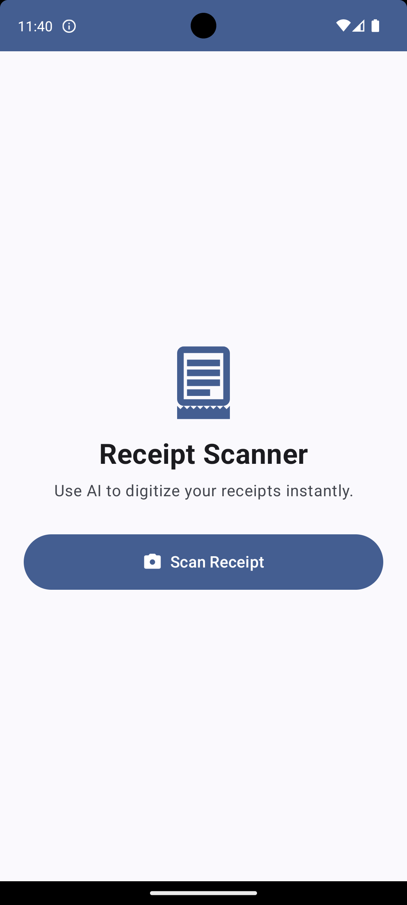
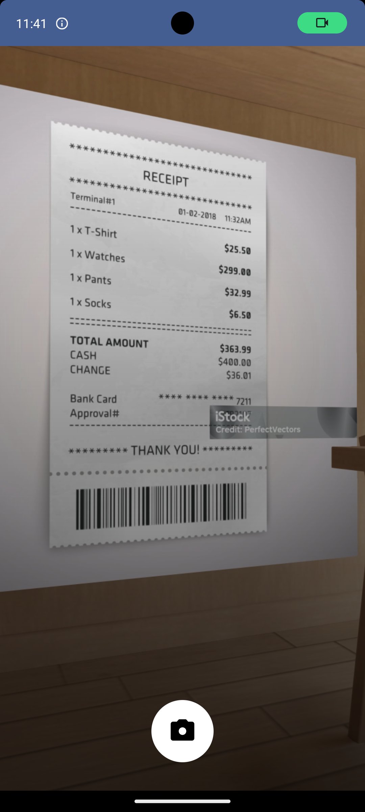
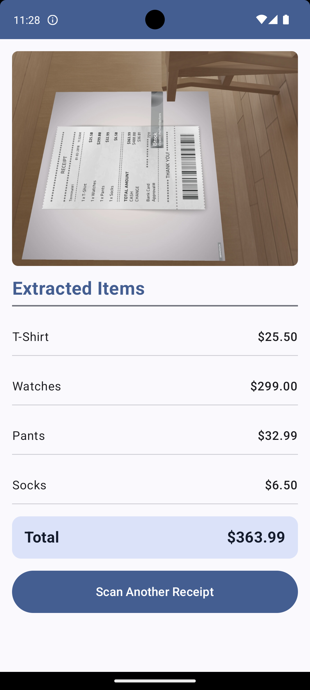

# AI Receipt Scanner - Android App

A native Android application that uses AI to scan and digitize supermarket receipts. Built with Jetpack Compose,
CameraX, and Google's Generative AI.

## Features

- 📱 Native Android app with modern Material 3 design
- 📸 Camera integration with CameraX for high-quality receipt capture
- 🤖 AI-powered receipt text extraction using Google Gemini
- 💾 Real-time receipt processing and itemization
- 🎨 Beautiful, responsive UI built with Jetpack Compose
- 🔒 Secure handling of camera permissions and API keys

## 📱 Screenshots

|                          Home                           |                            Scanner                             |                            Result                            |
|:-------------------------------------------------------:|:--------------------------------------------------------------:|:------------------------------------------------------------:|
|  |  |  |

## Requirements

- Android 7.0 (API level 24) or higher
- Camera permission
- Internet connection for AI processing
- Google Gemini API key

## Setup Instructions

1. **Clone the project** and open it in Android Studio

2. **Get a Gemini API Key:**
    - Go to [Google AI Studio](https://makersuite.google.com/app/apikey)
    - Create a new API key
    - Copy the API key

3. **Add your API key:**
    - Open `app/build.gradle.kts`
    - Replace `YOUR_GEMINI_API_KEY_HERE` with your actual API key:
   ```kotlin
   buildConfigField("String", "GEMINI_API_KEY", "\"your_actual_api_key_here\"")
   ```

4. **Build and run:**
    - Sync the project with Gradle files
    - Build and run on your Android device or emulator

## Architecture

The app follows modern Android development practices:

- **MVVM Architecture** with ViewModels and StateFlow
- **Jetpack Compose** for declarative UI
- **CameraX** for camera functionality
- **Kotlin Coroutines** for asynchronous operations
- **Material 3** design system
- **Kotlinx Serialization** for JSON parsing

## Project Structure

```
app/src/main/java/com/receiptscanner/app/
├── MainActivity.kt                 # Main Activity
├── data/
│   ├── ReceiptItem.kt             # Data models
│   └── ReceiptScannerUiState.kt   # UI state
├── ui/
│   ├── components/
│   │   └── CameraScreen.kt        # Camera UI component
│   ├── screens/
│   │   └── ReceiptScannerApp.kt   # Main app screens
│   └── theme/                     # Material 3 theme
├── viewmodel/
│   └── ReceiptScannerViewModel.kt # Business logic
└── utils/
    └── Utils.kt                   # Utility functions
```

## Dependencies

- **Jetpack Compose** - Modern UI toolkit
- **CameraX** - Camera functionality
- **Google Generative AI** - AI text extraction
- **Kotlinx Serialization** - JSON parsing
- **Material 3** - Design system
- **Coroutines** - Asynchronous programming

## Usage

1. Launch the app and grant camera permission
2. Tap "Scan Receipt" to open the camera
3. Point the camera at a receipt and tap the capture button
4. Wait for AI processing to extract items and total
5. View the digitized receipt with itemized list
6. Tap "Scan Another Receipt" to scan more receipts

## Security Notes

- API keys are stored in BuildConfig (not in version control)
- Camera permissions are requested at runtime
- No receipt data is stored permanently on device
- All AI processing happens via secure API calls

## License

Make sure to comply with Google's Generative AI terms of service when using their API.